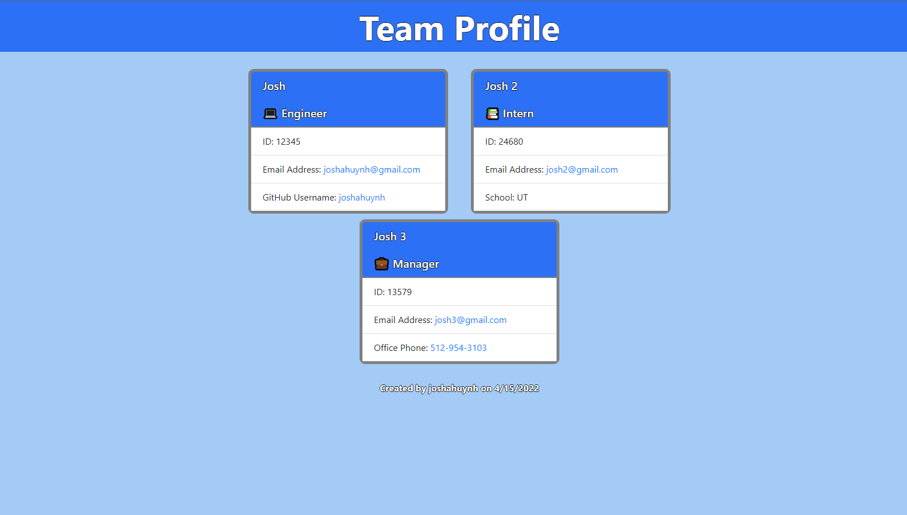

# Professional README Generator
  ## User Story:
  As a manager, I want to generate a webpage that displays my team's basic info, so that I have quick access to their emails and GitHub profiles.
  ## Acceptance Criteria:
  Given a command-line application that accepts user input, when I am prompted for my team members and their information. Then an HTML file is generated that displays a nicely formatted team roster based on user input, when I click on an email address in the HTML. Then my default email program opens and populates the TO field of the email with the address, when I click on the GitHub username. Then that GitHub profile opens in a new tab, when I start the application. Then I am prompted to enter the team manager’s name, employee ID, email address, and office number, when I enter the team manager’s name, employee ID, email address, and office number. Then I am presented with a menu with the option to add an engineer or an intern or to finish building my team, when I select the engineer option. Then I am prompted to enter the engineer’s name, ID, email, and GitHub username, and I am taken back to the menu, when I select the intern option. Then I am prompted to enter the intern’s name, ID, email, and school, and I am taken back to the menu, when I decide to finish building my team. Then I exit the application, and the HTML is generated.
  ## Table of Contents 
  - [Description](#description)
  - [Usage](#usage)
  - [Contact Me](#contact-me)
  - [Demo](#demo)
  ## Description:
  The team profile generator is a program used to create html for a page showing all of your team members and their inputed info.
  ## Usage:
  Run "node index.js" in the terminal and answer the following questions to generate your team profile!
  ## Demo:
  https://watch.screencastify.com/v/TXjBpQXVQZRCQiv0QypV
  ## Screenshot:
  
  ## Contact Me:
  - Github: [joshahuynh](https://github.com/joshahuynh)
  - Email: joshahuynh@gmail.com 
